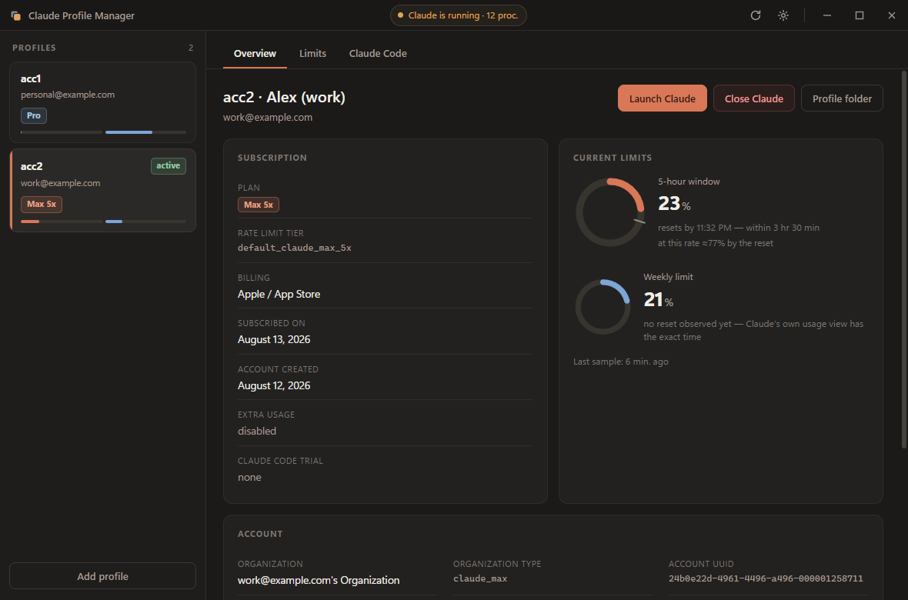
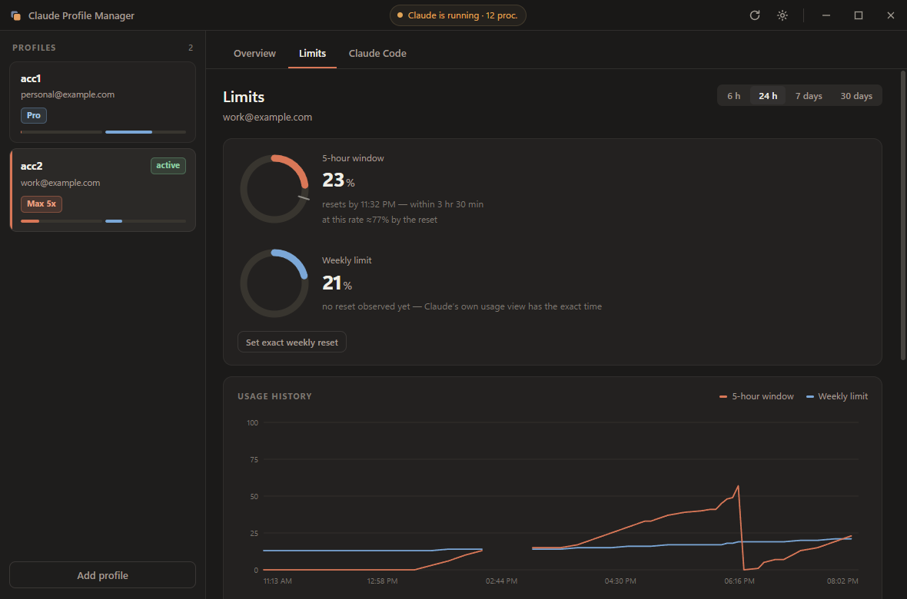
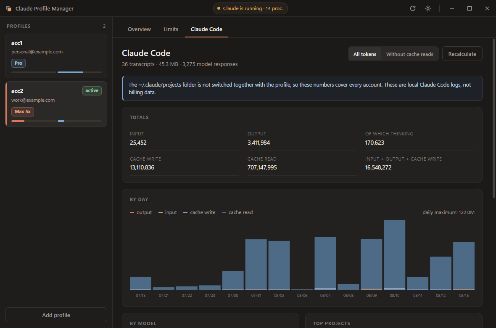
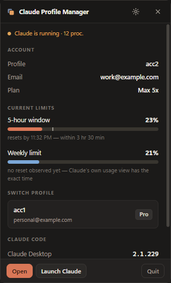
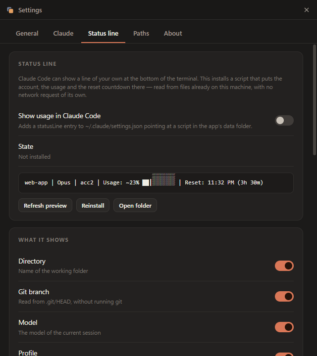

# Claude Plugboard

**Switch between multiple Claude accounts on Windows, and see the plan, subscription and
rate-limit usage of each one — without signing in and out by hand.**


An account switcher and usage dashboard for **Claude Desktop** and **Claude Code**.
Keeps a separate storage slot per account, swaps the session files in and out, and reads the
usage figures Claude already keeps on disk — including for the account you are *not*
currently signed into.

[Русская версия](README.ru.md) · [Disclaimer](DISCLAIMER.md) · [Changelog](CHANGELOG.md)

> **Unofficial third-party tool.** Not affiliated with, endorsed by, or supported by
> Anthropic. Intended for one person switching between accounts they are personally entitled
> to use — **not** for sharing accounts or working around usage limits. Your use of Claude
> stays governed by Anthropic's Consumer Terms and Usage Policy. Please read
> [DISCLAIMER.md](DISCLAIMER.md) before using it.
>
> **Written largely by an AI assistant**, with human direction and review. The full source is
> here — read it before trusting it with anything important.



---

## Why

Claude Desktop signs in one account at a time. If you have a personal Pro subscription and a
Max account from work, switching means signing out, signing in, and losing the session every
time. This app keeps the account files in per-profile storage and swaps them, so the session,
the cookies and the Claude Code credentials all come back exactly as you left them.

## Features

- **Profile switching** — any number of accounts. One click closes Claude, swaps the files
  and starts it again. Every move is journalled and rolled back if something fails halfway.
- **Account details** — plan (Pro / Max 5x / Max 20x), rate-limit tier, billing method,
  subscription date, organization, extra-usage flag. Shown for inactive profiles too.
- **Rate limits** — current 5-hour and weekly usage, reset time with a live countdown,
  history chart with gaps where Claude was closed, daily peaks, and a side-by-side
  comparison of every profile.
- **Pace** — a marker showing how much of the window has elapsed against how much of it you
  have spent, and where the current rate lands by the reset.
- **Claude Code usage** — token totals from local transcripts, by day, model and project.
- **Status line in the terminal** — usage, pace and countdown inside Claude Code itself.
  Optional, configurable, and the source of exact reset times. See below.
- **Tray icon** — a panel with the active account, usage meters and one-click switching.
  The icon itself can show the percentage as a bar, a number or a battery.
- **Installed Claude Code versions** — desktop bundle, npm CLI and editor extensions.
- **Notifications** — when a limit window crosses a threshold, and when it resets.
- **Autostart** — optional launch at Windows sign-in, optionally straight to the tray.
- **Dark, light and system theme.**
- **8 languages** — English, Deutsch, Español, Français, 日本語, Português, Русский, 简体中文.
  Follows the system language by default.
- **Exact figures, optionally** — off by default, asked about once. See below.
- **No runtime dependencies, no telemetry.**

## Estimates, and how to make them exact

Usage percentages read from disk are exact — they are the same numbers Claude shows.
**Reset times are not.** The file holds values rounded to whole percent, sampled every
~15 minutes, so the moment a window opened cannot be recovered from it. The app says
"resets by 18:42" rather than inventing a precise time, and says so plainly when a
weekly reset has never been observed.

Three ways to get exact reset times:

1. **The status line** (no network, recommended). Anthropic's API tells Claude Code the
   exact percentages and reset moments, and Claude Code passes them to whatever draws its
   status line. Install the status line below and the app records them and uses them —
   no token, no request, nothing of ours in the middle. Works for Pro and Max accounts,
   from the first reply in a Claude Code session.
2. **Calibration** (no network). Claude's own usage view states the weekly reset, e.g.
   "Resets Wed 7:00 AM". Enter that once — the whole string works — and it is exact from
   then on. The app also learns the anchor by itself the first time it observes a reset.
3. **Live usage** (opt-in, makes network requests). Reads the OAuth token Claude Code
   stored locally and asks `api.anthropic.com/api/oauth/usage` for the exact figures.
   Off by default, asked about once at first run, and limited to the active profile
   unless you widen it. Only works for profiles signed into Claude Code; otherwise the
   app offers to take a token by hand. Details in [SECURITY.md](SECURITY.md).

| Limits | Claude Code | Tray |
|---|---|---|
|  |  |  |

## Install

Download from [Releases](../../releases):

- **`Claude Plugboard-Setup-<version>.exe`** — installer, adds Start menu and desktop
  shortcuts.
- **`Claude Plugboard-<version>-portable.exe`** — single file, no installation.

Windows 10 or 11, x64. The binaries are unsigned, so SmartScreen warns on first run —
*More info* → *Run anyway*. Prefer to avoid that? Build it yourself, it takes a minute.

### From source

```bash
npm install
npm start
```

```bash
npm run build
```

## How switching works

A profile is the set of files that identify the signed-in account. They move between their
working locations and a storage slot in `~/.claude-profiles/<slot>`:

| Location | Items | Belongs to |
|---|---|---|
| `%APPDATA%\Claude` | `Network`, `Local Storage`, `Session Storage`, `IndexedDB`, `Local State`, `config.json` | Claude Desktop |
| `%USERPROFILE%` | `.claude.json` | Claude Code |
| `%USERPROFILE%\.claude` | `.credentials.json` | Claude Code |

The active slot name lives in `~/.claude-profiles/current.txt`.

**Claude must be closed while switching** — swapping files under a running process corrupts
the profile. The app checks, offers to close Claude (gracefully first, forcefully second),
and journals every move so a mid-way failure is rolled back rather than left half-applied.

`plan-usage-history.json` is deliberately **not** switched. Every sample in it is tagged with
an organization id, so one shared file holds the limit history of all accounts — which is
exactly what makes comparing them possible.

## Status line in the terminal

Claude Code can draw a line of your own at the bottom of the terminal. **Settings → Status
line** installs one:

```
claude-plugboard │ main │ Opus │ work │ Usage: 24% ██░░░░░┃░░ │ Reset: 20:56 (1h 06m)
```

Directory, git branch, model, which account this app has active, context window, 5-hour and
weekly usage, a ten-cell bar with the pace marker, the reset countdown and Claude Code's own
session cost — each one can be switched off, and so can the colours, the labels and the
refresh timer. The preview in Settings is the actual script's output, not a mock-up.



It is a PowerShell script in the app's data directory plus a `statusLine` entry in
`~/.claude/settings.json`; every other key in that file is left alone, and a status line you
already had is remembered and put back when you turn this off. The script reads the JSON
Claude Code hands it and a state file the app writes. It makes no network request, and it
works whether or not the app is running.

**This is also where exact figures come from.** Claude Code receives the real percentages
and reset moments with its API responses and passes them to the status line, which records
them for the app. That is the whole trick: exact resets with no request of our own. It is
per-account, and only appears once a Claude Code session has had a reply.

### Beyond the desktop app

Claude Code — the CLI and the editor extensions — authenticates through `~/.claude`, which is
part of the switched set by default. **Settings → Claude** lets you narrow that to *Desktop
only* or *Claude Code only* if you want the two to stay independent.

## Where the data comes from

Everything is read from files on this machine. Nothing is fetched from the network unless
you turn on live usage.

| Source | Used for |
|---|---|
| `~/.claude.json` → `oauthAccount` | plan, tier, billing, subscription dates, organization |
| `~/.claude-profiles/<slot>/home_.claude.json` | the same, for profiles that are not active |
| `%APPDATA%\Claude\plan-usage-history.json` | 5-hour and weekly usage percentages over time |
| `~/.claude/projects/**/*.jsonl` | Claude Code tokens per day, model and project |
| `statusline/bridge.json` in the app's data directory | exact percentages and reset times, recorded by the status line |

Reset times are derived from the last time a counter dropped to zero, so they are estimates
rather than official dates. Claude Code totals cover every account, because
`~/.claude/projects` is not part of the switched set.

## Adding an account

1. **Add profile** in the sidebar, give the slot a name.
2. Switch to it — Claude starts signed out.
3. Sign in with the account you want.
4. The next switch saves that session into the slot.

Deleting a profile moves it to `~/.claude-profiles/_trash/<slot>-<timestamp>` instead of
erasing it. The active profile cannot be deleted.

## Project layout

```
src/
  main.js              Electron main process: windows, tray, autostart, notifications, IPC
  preload.js           contextBridge bridge
  core/
    paths.js           paths and the set of switched files
    config.js          settings store in userData
    claudeApp.js       detect / launch / close Claude Desktop, detect Claude Code
    profiles.js        read profiles, switch with rollback, slot management
    usage.js           parse plan-usage-history.json, limit windows, reset estimates
    pace.js            elapsed vs spent, and where the current rate lands
    cliusage.js        aggregate Claude Code tokens, cached by mtime + size
    statusline.js      install, configure and preview the Claude Code status line
    trayIcon.js        the tray icon drawn from raw pixels
    versions.js        which Claude Code builds are installed
  statusline/          the PowerShell script copied out to the user's machine
  i18n/                one file per language, en.js is the source of truth
  renderer/            main, settings, tray panel and consent windows; charts are inline SVG
tools/make-icon.js     icon generator built on zlib alone
```

Electron is the only dependency. Charts are hand-drawn SVG, the icons are generated at build
time from raw pixel data — no chart library, no image toolchain.

## On macOS, use Claude Usage Tracker

[**Claude-Usage-Tracker**](https://github.com/hamed-elfayome/Claude-Usage-Tracker) is a
native macOS menu-bar app covering this ground on the Mac, and covering it well. It is MIT
licensed, code signed, and actively maintained. This project stays on Windows and points
Mac users there rather than shipping a worse second implementation. Its feature set is also
the reference this app measures itself against — see [PLATFORM-SUPPORT.md](docs/PLATFORM-SUPPORT.md).

## Compatibility

Windows 10/11, x64. Both Claude Desktop distributions are detected automatically: the
Microsoft Store (MSIX) build, launched through its AppUserModelID, and the installer
(Squirrel) build, launched by executable. Override it in **Settings → Claude** if detection
picks the wrong one.

Everything system-specific is isolated in `src/core/platform.js`; the rest of the core has
no platform coupling. A port is possible, but must not enable profile switching until the
account file set has been confirmed on that system.

The switched file list mirrors the layout Claude Desktop uses today. If a future version
stores its session elsewhere, switching will need updating — that is the most likely way this
project breaks, and the most useful thing to report.

## Contributing

See [CONTRIBUTING.md](CONTRIBUTING.md). Adding a language is a single file, and untranslated
keys fall back to English, so partial translations are welcome.

Security reports: [SECURITY.md](SECURITY.md).

## License

[MIT](LICENSE)
